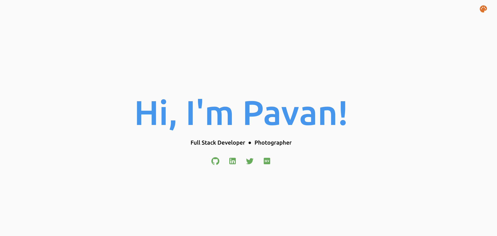
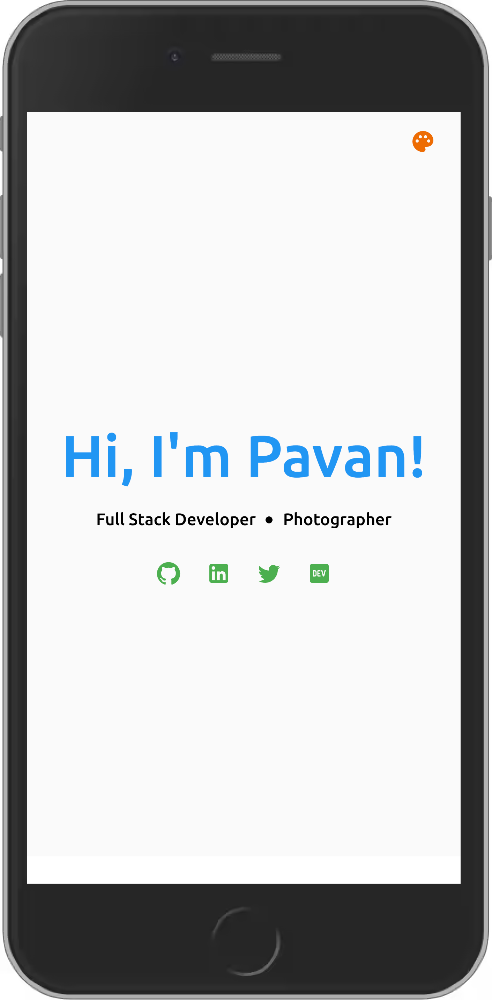

# Dev Landing Page

A minimal introductory page for developers. Feel free to make yours!

### Deployment 🚀

This application has been deployed using AWS Amplify.

https://master.d1mxeizd5j5ul.amplifyapp.com

### Workflow 🔧

Github workflow is setup for this project which runs lint and test cases on opening a pull request.

### Application

Keeping responsiveness in mind, I have developed this app which can fit in all the devices - PCs to mobile devices.

<table border="0">
 <tr>
    <td><b style="font-size:14px">Desktop view</b></td>
    <td><b style="font-size:14px">Mobile view</b></td>
 </tr>
 <tr>
    <td style="width: 50%">
    
    </td>
    <td style="width: 50%; height: 140px"></td>
 </tr>
</table>

### Development 👨‍💻

To run the application in development mode

```
npm run start
```

### Tests ⚙️

React testing library is being used for unit testing React components.

### Scripts 🧰

ESLint and prettier are configured in this project.

To run lint

```
npm run lint
```

To format the code

```
npm run format
```
